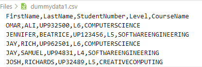
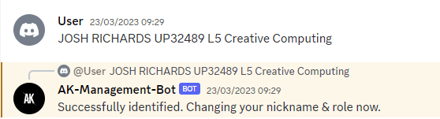
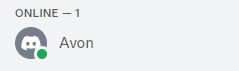
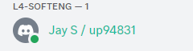
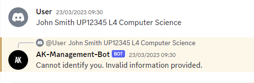

# Discord-Management-Bot

NOTE: The word "client" in this file refers to the person who will be making use of this bot, which will most likely be a University of Portsmouth staff member. The word "user" or "users" refers to the users or students in a Discord server.

This is a Discord bot created to help manage the University of Portsmouth official Discord server. The bot has many functionalities built in to help manage a large Discord server like the University Discord server with the two main functionalities being:

- Verifying new students who join the Discord server by reading a CSV file containing UoP students information which will be input by the client.
- Updating students roles based on progress decisions at the end of the academic year by reading a CSV file containing the progress decisions of each student which will be input by the client.

The bot also comes with a dashboard created with Node & Express to allow the client to input any neccessary CSV files to the bot and to toggle certain features such as security mode (a mode that allows the client to input a security question that users must answer when verifying themselves with the bot) on or off.

# Usage

See the [documentation](https://github.com/ak292/discord-management-bot/blob/main/DOCUMENTATION.md) for a full breakdown of the Express server file containing the API endpoints & the Discord server file containing all the main logic/functionality of the bot.

Verification process of the bot:

Once the client has input their verification CSV file containing the students information which can be easily done with a simple drag & drop in the NodeJS dashboard, the bot can use it to verify new users/students who join the Discord server. See an example of verification below:

An example of a CSV file the client can input:

An example of a user successfully verifying themself:

As can be seen from the image above, the verification was successful because the user input correct details that were found in the CSV file that was input by the client. In this case, the user verified themselves using the information that can be found on the 5th row of the CSV file that was input.

The following images show the Discord user in the server before being verified by the bot, and after being verified by the bot, respectively. Notice how the after image shows the users nickname changed accordingly as well as their level & role.

An example of a user unsuccessfully verifying themself:

As can be seen from the image above, the verification was unsuccessful because the user input details that were not found in any rows of the CSV file that was input by the client.

Other functionaltiies of the bot such as security mode or updating roles using progress decisions are very easy to use, so they require no examples. For example, updating users roles in the server using a CSV file containing progress decisions is as simple as dropping the CSV file in the specified area in the Discord bot dashboard and the bot will automatically update the roles accordingly.

# How to Run Bot in Your Server (READ BEFORE INSTALLING)

Before following the installation instructions below, a few changes are required before the bot can successfully run in the Discord server you want it to run in. However, **if you would like to skip all the steps below and jump right into testing the bot, you can simply join this [Discord server](https://discord.gg/kGdW5vbgWy) I have created for your convenience and you may ignore all the steps below.** This Discord server already has the bot as a member inside it along with a few random Discord users that are in the Discord server for testing purposes (these users can be used to test the bots verification/progress decisions functionality). **However, if you would like to run the Discord bot in your own server, please continue reading the steps below.**

1. Add the Discord bot to your server by clicking this [link](https://discord.com/api/oauth2/authorize?client_id=1034879663111147570&permissions=8&scope=bot%20applications.commands). This link will redirect you to the official Discord website and will ask you to authorize the Discord bot and allow it to join your server. It should be noted that you must have "Manage Server" privileges in the Discord server you would like to add the bot in or else this will not work.

2. Grab the UID of the Discord server you would like to add the bot in. It is important to note that you must have developer mode activated to be able to grab Discord UIDs. This mode can easily be turned on in your user settings on Discord. Afterwards, go to line 10 in the [Discord server file](https://github.com/ak292/discord-management-bot/blob/main/discordServer.js) and change the value of the "guildID" variable to the UID you just grabbed. Afterwards, go to line 514 and replace the UID there with the UID you just grabbed as well.

3. Since this bot was created specifically for the official UoP Discord server, it is assumed that the server will have L4/L5/L6 SE roles, L4/L5/L6 NON-SE roles, an L7MENG role, and an ALUMNI role, just like the UoP server does. You need to grab the UID of each one of these roles in your Discord server and replace them accordingly in the "roles" object that can be found on line 116 of the [Discord server file](https://github.com/ak292/discord-management-bot/blob/main/discordServer.js). To grab the UID of a role in your Discord server, simply go to "Server Settings", then click "Roles", then right click on the role you want to copy and click "Copy ID".

4. Create a .env file and add this line to it: "TOKEN=MTAzNDg3OTY2MzExMTE0NzU3MA.G0HQvC.CWe6gU5eCr_dhlcx8TsT0UlaCjAb382c2bP8k8" without the quotation marks. Normally, it is obviously not a good idea to share the Discord bot token as this is a major security risk as it allows anyone to use the Discord bot maliciously, but for the purposes of this project I have made it public here as it is neccessary to get the bot up and running. This token will be discarded and renewed by me at a later date, before this repository is made public.

That's it! You may now continue reading below to install and run the bot.

# Requirements

Must have NodeJS installed.

# Install

1. Run npm install
2. Run npm start
3. Navigate to localhost:3000 in your browser to see the dashboard created using Node/Express. At this point, the bot will automatically be up and running in your Discord server as well, waiting for you to input a CSV file and interact with it.
