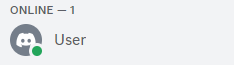

# Discord-Management-Bot

**NOTE:** The word "client" in this file refers to the person who will be making use of this bot, which will most likely be a University of Portsmouth staff member. The word "user" or "users" refers to the users or students in a Discord server.

This is a Discord bot created to help manage the University of Portsmouth official Discord server. This bot was created as the software artefact of my final year graduation project as a Computer Science student at the University of Portsmouth. The bot has many functionalities built in to help manage a large Discord server like the University Discord server with the two main functionalities being:

- Verifying new students who join the Discord server by reading a CSV file containing UoP students information which will be input by the client.
- Updating students roles based on progress decisions at the end of the academic year by reading a CSV file containing the progress decisions of each student which will be input by the client.

The bot also comes with a dashboard created with Node & Express to allow the client to input any neccessary CSV files to the bot and to toggle certain features such as security mode (a mode that allows the client to input a security question that users must answer when verifying themselves with the bot) on or off.

# Usage

See the [documentation](https://github.com/ak292/discord-management-bot/blob/main/DOCUMENTATION.md) for a full breakdown of the Express server file containing the API endpoints & the Discord server file containing all the main logic/functionality of the bot.

Examples for the two main features of the Discord bot (verifying students & updating roles based on progress decisions) will be shown below.

### Verifying students

Once the client has input their verification CSV file containing the students information which can be easily done with a simple drag & drop in the NodeJS dashboard, the bot can use it to verify new users/students who join the Discord server. See an example of verification below:

An example of a CSV file containing the students verification information that the client can input:


An example of a user successfully verifying themself by DMing the bot:


As can be seen from the image above, the verification was successful because the user input correct details that were found in the CSV file that was input by the client. In this case, the user verified themselves using the information that can be found on the 5th row of the CSV file that was input.

The following images show the Discord user in the server before being verified by the bot, and after being verified by the bot, respectively. Notice how the after image shows the users nickname changed accordingly as well as their level & role.




A GIF showing the verification process (Notice the nickname/role change in the Discord server on the right as soon as the user is verified):


As you can see, the verification in the GIF worked because the information input was found in the CSV file, specifically on row 3 in this case.

An example of a user unsuccessfully verifying themself:


As can be seen from the image above, the verification was unsuccessful because the user input details that were not found in any rows of the CSV file that was input by the client.

### Updating roles based on progress decisions

An example of a CSV file containing the progress decisions for each student (PROGRESS indicates the student has passed the year and will progress to the next level, REPEAT indicates the student has failed the year and must repeat) as well as their student number so they can be identified:


A GIF showing how the bot updates roles based on progress decisions:


Note that because both of those students with those student numbers had received a "PROGRESS" decision, they progressed from Level 4 to Level 5 and then to Level 6. One progression was made for each time the CSV file was dragged & dropped. If they had received a "REPEAT" decision, they would not have progressed.

Other functionalties of the bot such as security mode (which allows for the client to input a security question for the bot to ask upon verification) or abbreviations mode (which allows the client to customize any abbreviations they may be using in their "Course Name" column in their CSV) are quite simple so they require no examples.

# How to Run Bot in Your Server (READ BEFORE INSTALLING)

1. Create a Discord bot from the Discord developer dashboard, and make sure to give the bot administrator priviledges when creating it, as the bot must have the ability to read and respond to messages, DM users, give roles, etc.

2. Grab the Discord bot token of the bot you just created, and paste it into a .env file that should be in the root of the directory. 

3. Add the Discord bot to the server you would like to run the bot in. It should be noted that you must have "Manage Server" privileges in the Discord server you would like to add the bot in or else this will not work.

4. Grab the UID of the Discord server you would like to add the bot in. It is important to note that you must have developer mode activated to be able to grab Discord UIDs. This mode can easily be turned on in your user settings on Discord. Afterwards, go to line 10 in the [Discord server file](https://github.com/ak292/discord-management-bot/blob/main/discordServer.js) and change the value of the "guildID" variable to the UID you just grabbed. Afterwards, go to line 514 and replace the UID there with the UID you just grabbed as well.

5. Since this bot was created specifically for the official UoP Discord server, it is assumed that the server will have L4/L5/L6 SE roles (which represent Year 1, Year 2, and Year 3 Software Engineering students respectively), L4/L5/L6 NON-SE roles (which represent Year 1, Year 2, and Year 3 Non-Software Engineering students), an L7MENG role (which represents a masters level student), and an alumni role which is self-explanatory. This is exactly how the official University of Portsmouth Discord server is set up. You will need to grab the UID of each one of these roles in your Discord server and replace them accordingly in the "roles" object that can be found on line 116 of the [Discord server file](https://github.com/ak292/discord-management-bot/blob/main/discordServer.js). To grab the UID of a role in your Discord server, simply go to "Server Settings", then click "Roles", then right click on the role you want to copy and click "Copy ID".

That's it! You may now continue reading below to install and run the bot.

# Requirements

Must have NodeJS installed.

# Install & How to Run

1. Run ```npm install```
3. Run ```npm start``` - Running this command will concurrently start up both the Node/Express server as well as the Discord bot.
4. Navigate to localhost:3000 in your browser to see the dashboard created using Node/Express. At this point, the bot will automatically be up and running in your Discord server as well, waiting for you to input a CSV file and interact with it.
5. Once you've input a verification CSV file (there are many test files available in the csvTestFiles folder named dummydata1, dummydata2, dummydata3):

    - You can start by DMing the bot to interact with it and you could attempt to verify yourself using any of the information found in the CSV test file of your choosing. 
    - It is also important to note that at this point, any new users who join the Discord server will automatically be DM'd by the bot, prompting them to verify themself. You can test this feature too by simply leaving the server the bot is in & rejoining it.
    - You can also test other features such as the progress decisions role updating feature by inputting a progress decisions CSV file (there is a test file named progressDecisions.csv in the csvTestFiles folder as well).
    - Other things such as security mode/abbreviations mode can be toggled on or off using the dashboard at localhost:3000.
